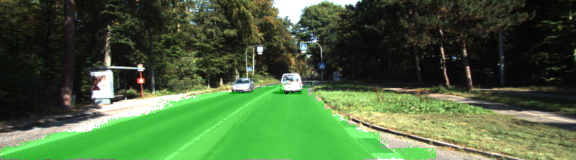
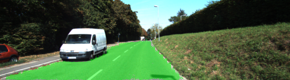
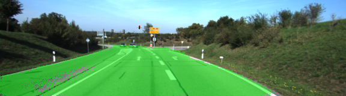

# Semantic Segmentation
This project shows a Fully Convolutional Network (FCN) that labels pixels in an image that belong to the class `road`.

## Setup
### GPU
This project requires a GPU. `main.py` will check to make sure you are using it.

### Environment setup
Make sure [Anaconda](https://www.anaconda.com/) is installed on your system:
```sh
conda -V
```

Then
```sh
conda create --n sem-seg python=3.6 pip
source activate sem-seg
pip install -r requirements.txt
```

### Dataset
Download the [Kitti Road dataset](http://www.cvlibs.net/datasets/kitti/eval_road.php) from [here](http://www.cvlibs.net/download.php?file=data_road.zip).  Extract the dataset in a `data` folder.  This will create the folder `data_road` with all the training a test images.

## Start
Run the following command to run the project:
```
python main.py
```


## Result
Here are examples outputs of the trained network:




